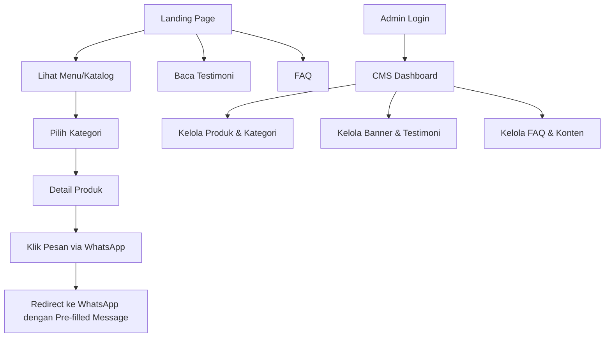
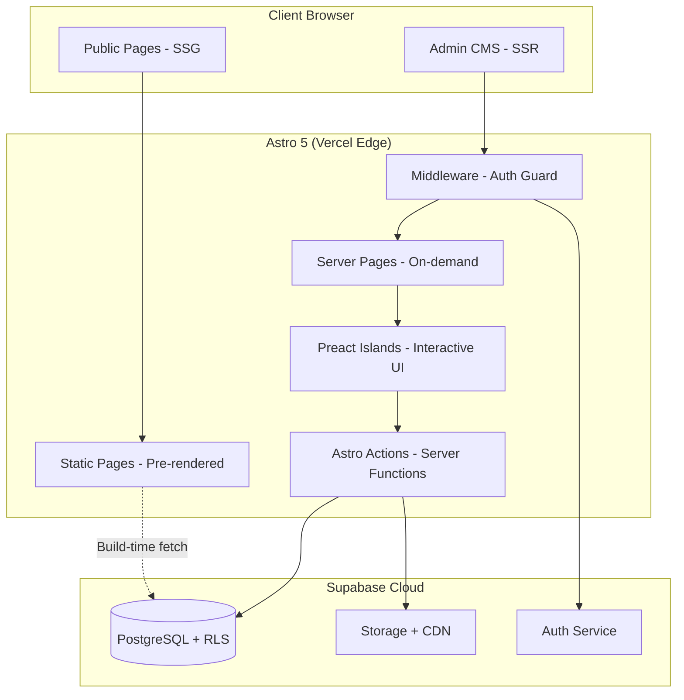
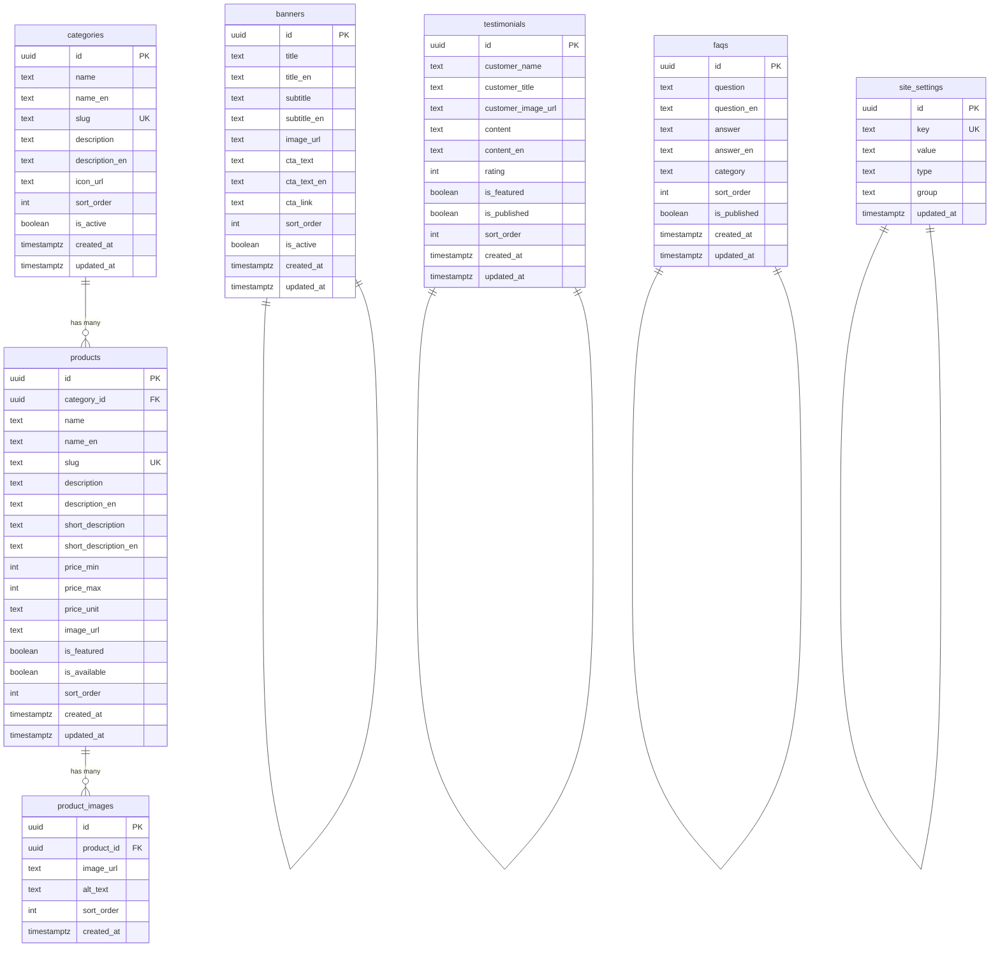
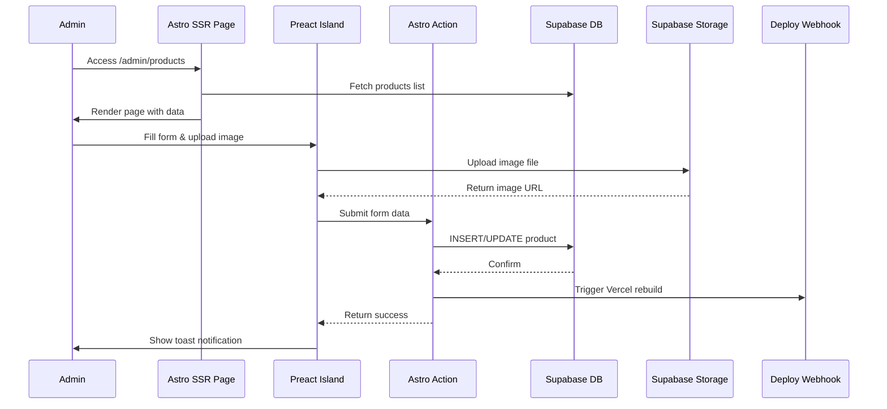
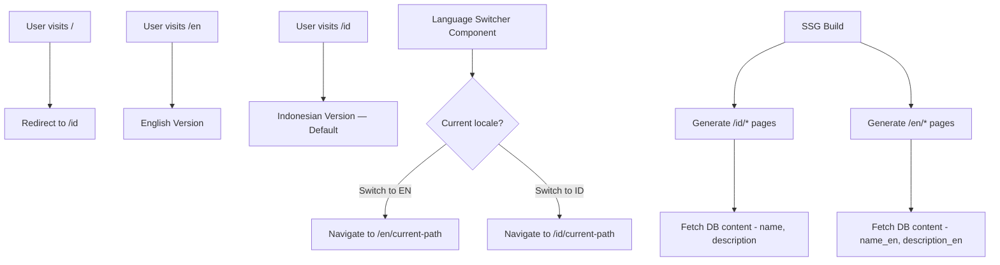
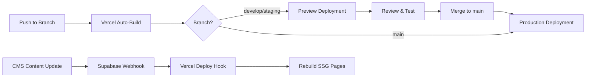

# 🍽️ Sari Susanti — Catering & Jajanan Pasar Website
### Project Planning & Technical Architecture Document

> **Tagline:** *"Sari Rasa Nusantara, Sentuhan Selera Ibu."*
> **Scope:** Landing Page + Katalog Menu + WhatsApp Ordering + CMS Admin

---

## 1. PRODUCT PLANNING

### A. Product Vision
Website brand modern untuk **Sari Susanti Catering & Jajanan Pasar** yang menjadi etalase digital utama bisnis katering keluarga dengan cita rasa Nusantara dan Sundanese. Berakar dari resep autentik keluarga Susanti asal Tasikmalaya, katering ini siap melayani berbagai pesanan untuk area Jabodetabek. Website ini berfungsi sebagai:
- **Storefront Digital** — menampilkan brand story, menu, dan testimoni
- **Conversion Funnel** — mengarahkan pengunjung untuk memesan via WhatsApp
- **Content Management System** — memungkinkan admin mengelola seluruh konten website

### B. Target Audience

| Segmen | Deskripsi | Kebutuhan |
|:---|:---|:---|
| **Ibu Rumah Tangga** | Usia 30-55, mencari katering acara keluarga | Navigasi mudah, foto menarik, harga jelas |
| **Event Organizer** | Profesional yang butuh vendor katering | Katalog lengkap, portofolio, kontak cepat |
| **Karyawan Kantor** | Pemesanan nasi box & snack box rutin | Proses order cepat, menu harian |
| **Admin/Owner** | Ibu Teti & tim | Dashboard mudah untuk update konten |

### C. Core User Flows



---

## 2. FEATURE PLANNING

### A. Public Website (No Auth Required)

| # | Feature | Prioritas | Deskripsi |
|:--|:---|:---:|:---|
| 1 | **Hero Section & Banner** | MVP | Carousel/hero banner dengan CTA utama, managed via CMS |
| 2 | **Brand Story** | MVP | Sejarah & filosofi brand, visi misi |
| 3 | **Katalog Menu** | MVP | Browsing menu per kategori (Sari Savory, Sari Sweet & Bites, Sari Tumpeng & Hantaran) |
| 4 | **Detail Produk** | MVP | Foto, deskripsi, harga, tombol pesan WhatsApp |
| 5 | **WhatsApp Order** | MVP | Redirect ke WA dengan pre-filled message berisi detail pesanan |
| 6 | **Testimoni** | MVP | Grid/carousel testimoni pelanggan, managed via CMS |
| 7 | **FAQ** | MVP | Accordion FAQ, managed via CMS |
| 8 | **Kontak & Lokasi** | MVP | Info kontak, alamat, embedded map |
| 9 | **🌐 Bilingual (ID/EN)** | MVP | Default Bahasa Indonesia, dapat diubah ke English via language switcher |
| 10 | **Gallery** | v1.1 | Galeri foto acara & hasil masakan |
| 11 | **Blog/Artikel** | v2.0 | Konten SEO: tips acara, resep, dll (bilingual) |

### B. CMS Admin (Auth Required)

| # | Feature | Prioritas | Deskripsi |
|:--|:---|:---:|:---|
| 1 | **Auth (Login/Logout)** | MVP | Supabase Auth, single admin account, no public register |
| 2 | **Dashboard** | MVP | Overview statistik sederhana |
| 3 | **Kelola Kategori** | MVP | CRUD kategori menu (nama ID/EN, deskripsi ID/EN, icon, urutan) |
| 4 | **Kelola Produk** | MVP | CRUD produk (nama ID/EN, harga, foto, deskripsi ID/EN, kategori, status) |
| 5 | **Kelola Banner** | MVP | CRUD hero banner (gambar, judul ID/EN, subtitle ID/EN, CTA ID/EN, urutan) |
| 6 | **Kelola Testimoni** | MVP | CRUD testimoni (nama, teks, foto, rating, status publish) |
| 7 | **Kelola FAQ** | MVP | CRUD FAQ (pertanyaan ID/EN, jawaban ID/EN, urutan, status) |
| 8 | **Kelola Konten Statis** | v1.1 | Edit About Us ID/EN, Brand Story ID/EN, info kontak |
| 9 | **Kelola Gallery** | v1.1 | Upload & manage foto galeri |
| 10 | **Kelola Blog** | v2.0 | Rich text editor untuk artikel (bilingual) |

---

## 3. TECHNICAL ARCHITECTURE

### A. Rekomendasi Technology Stack

| Layer | Teknologi | Alasan |
|:---|:---|:---|
| **Framework** | **Astro 5** (Hybrid Rendering) | SSG untuk public pages (SEO & performance maksimal), SSR untuk admin CMS |
| **UI Library** | **Preact** (Astro Island) | Lightweight (3KB) untuk komponen interaktif (carousel, modal, form CMS) |
| **Styling** | **Vanilla CSS** + **CSS Custom Properties** | Full control, zero bundle, sesuai brand palette |
| **Database** | **Supabase (PostgreSQL)** | Managed DB, realtime, RLS, free tier generous |
| **Auth** | **Supabase Auth** + `@supabase/ssr` | Cookie-based SSR auth, built-in admin |
| **Storage** | **Supabase Storage** | Image upload, on-the-fly transform, CDN built-in |
| **i18n** | **Astro built-in i18n** + custom translation files | Native Astro i18n routing (`/id/*`, `/en/*`), zero extra deps, URL-based locale |
| **Deployment** | **Vercel** | Edge network, auto-preview, Astro first-class support |
| **SEO** | `astro-seo` + `schema-dts` | Meta tags, structured data, sitemap |
| **Icons** | **Lucide Icons** (via astro-icon) | Lightweight, tree-shakeable icon set |
| **Animations** | **CSS Animations** + **Intersection Observer** | Native, zero-dependency scroll reveals |

### B. Architecture Diagram



### C. Rendering Strategy

| Route | Mode | Alasan |
|:---|:---|:---|
| `/` | **SSG + Redirect** | Redirect ke `/id` (default locale) |
| `/id` (Landing ID) | **SSG** | Bahasa Indonesia — maximum performance & SEO |
| `/en` (Landing EN) | **SSG** | English version — separate static page |
| `/id/menu` | **SSG** | Katalog menu Bahasa Indonesia |
| `/en/menu` | **SSG** | Menu catalog in English |
| `/id/menu/[slug]` | **SSG** | Detail produk per item (ID) |
| `/en/menu/[slug]` | **SSG** | Product detail per item (EN) |
| `/id/tentang-kami` | **SSG** | Konten statis |
| `/en/about` | **SSG** | Static content |
| `/id/faq` | **SSG** | Konten statis |
| `/en/faq` | **SSG** | Static content |
| `/id/kontak` | **SSG** | Konten statis |
| `/en/contact` | **SSG** | Static content |
| `/admin/login` | **SSR** | Auth handling |
| `/admin/*` | **SSR** | Protected, dynamic CMS dashboard |

### D. Data Flow Architecture

```
┌─────────────────────────────────────────────────────────┐
│                    BUILD TIME (SSG)                       │
│                                                          │
│  Astro Build ──► Supabase Query ──► Static HTML Pages    │
│                                                          │
│  Trigger: Webhook dari CMS ──► Vercel Rebuild            │
└─────────────────────────────────────────────────────────┘

┌─────────────────────────────────────────────────────────┐
│                   RUNTIME (SSR/Admin)                     │
│                                                          │
│  Browser ──► Astro Middleware (auth check)                │
│          ──► SSR Page Render                              │
│          ──► Preact Island (interactive form)             │
│          ──► Astro Action (server mutation)               │
│          ──► Supabase (DB/Storage)                        │
│          ──► Response                                     │
└─────────────────────────────────────────────────────────┘
```

> [!IMPORTANT]
> **Rebuild Strategy:** Setiap kali admin mengubah konten via CMS, sebuah Supabase Database Webhook akan men-trigger Vercel Deploy Hook untuk me-rebuild halaman SSG. Ini memastikan public pages selalu up-to-date tanpa mengorbankan performance. Kedua versi bahasa (ID & EN) di-rebuild sekaligus.

---

## 4. DATABASE PLANNING

### A. Entity Relationship Diagram



### B. Table Specifications

#### `categories`
| Column | Type | Constraint | Keterangan |
|:---|:---|:---|:---|
| `id` | `uuid` | PK, default `gen_random_uuid()` | |
| `name` | `text` | NOT NULL | Nama kategori (ID): "Sari Savory", "Sari Sweet & Bites" |
| `name_en` | `text` | | Category name (EN): "Sari Savory", "Sari Sweet & Bites" |
| `slug` | `text` | UNIQUE, NOT NULL | URL-friendly: "sari-savory" (shared across locales) |
| `description` | `text` | | Deskripsi kategori (Bahasa Indonesia) |
| `description_en` | `text` | | Category description (English) |
| `icon_url` | `text` | | URL icon/gambar kategori |
| `sort_order` | `integer` | default `0` | Urutan tampil |
| `is_active` | `boolean` | default `true` | Status aktif |
| `created_at` | `timestamptz` | default `now()` | |
| `updated_at` | `timestamptz` | default `now()` | Auto-update via trigger |

#### `products`
| Column | Type | Constraint | Keterangan |
|:---|:---|:---|:---|
| `id` | `uuid` | PK | |
| `category_id` | `uuid` | FK → categories | Relasi ke kategori |
| `name` | `text` | NOT NULL | Nama produk (Bahasa Indonesia) |
| `name_en` | `text` | | Product name (English) |
| `slug` | `text` | UNIQUE, NOT NULL | URL-friendly, shared across locales |
| `description` | `text` | | Deskripsi lengkap (ID, supports markdown) |
| `description_en` | `text` | | Full description (EN, supports markdown) |
| `short_description` | `text` | | Deskripsi singkat untuk card (ID) |
| `short_description_en` | `text` | | Short description for card (EN) |
| `price_min` | `integer` | | Harga minimum (dalam Rupiah, tanpa desimal) |
| `price_max` | `integer` | | Harga maksimum (range harga) |
| `price_unit` | `text` | default `'porsi'` | Satuan: "porsi", "box", "paket", "loyang" |
| `image_url` | `text` | | URL gambar utama |
| `is_featured` | `boolean` | default `false` | Tampil di homepage |
| `is_available` | `boolean` | default `true` | Status ketersediaan |
| `sort_order` | `integer` | default `0` | |
| `created_at` | `timestamptz` | default `now()` | |
| `updated_at` | `timestamptz` | default `now()` | |

#### `banners`
| Column | Type | Constraint | Keterangan |
|:---|:---|:---|:---|
| `id` | `uuid` | PK | |
| `title` | `text` | NOT NULL | Judul banner (Bahasa Indonesia) |
| `title_en` | `text` | | Banner title (English) |
| `subtitle` | `text` | | Sub-judul (ID) |
| `subtitle_en` | `text` | | Subtitle (EN) |
| `image_url` | `text` | NOT NULL | URL gambar banner |
| `image_alt` | `text` | | Alt text untuk SEO/accessibility |
| `cta_text` | `text` | | Teks tombol CTA (ID) |
| `cta_text_en` | `text` | | CTA button text (EN) |
| `cta_link` | `text` | | Link tujuan CTA |
| `sort_order` | `integer` | default `0` | Urutan carousel |
| `is_active` | `boolean` | default `true` | |
| `created_at` | `timestamptz` | | |
| `updated_at` | `timestamptz` | | |

#### `testimonials`
| Column | Type | Constraint | Keterangan |
|:---|:---|:---|:---|
| `id` | `uuid` | PK | |
| `customer_name` | `text` | NOT NULL | Nama pelanggan |
| `customer_title` | `text` | | Jabatan/deskripsi: "Ibu Rumah Tangga, Bandung" |
| `customer_image_url` | `text` | | Foto pelanggan (optional) |
| `content` | `text` | NOT NULL | Isi testimoni |
| `rating` | `integer` | CHECK 1-5 | Rating bintang |
| `event_type` | `text` | | Jenis acara: "Pernikahan", "Khitanan", dll |
| `is_featured` | `boolean` | default `false` | Tampil di homepage |
| `is_published` | `boolean` | default `true` | Status publish |
| `sort_order` | `integer` | default `0` | |
| `created_at` | `timestamptz` | | |
| `updated_at` | `timestamptz` | | |

#### `faqs`
| Column | Type | Constraint | Keterangan |
|:---|:---|:---|:---|
| `id` | `uuid` | PK | |
| `question` | `text` | NOT NULL | Pertanyaan (Bahasa Indonesia) |
| `question_en` | `text` | | Question (English) |
| `answer` | `text` | NOT NULL | Jawaban (ID, supports markdown) |
| `answer_en` | `text` | | Answer (EN, supports markdown) |
| `category` | `text` | | Grup FAQ: "Pemesanan", "Pengiriman", "Pembayaran" |
| `sort_order` | `integer` | default `0` | |
| `is_published` | `boolean` | default `true` | |
| `created_at` | `timestamptz` | | |
| `updated_at` | `timestamptz` | | |

#### `site_settings` (Key-Value Store untuk konten statis)
| Column | Type | Constraint | Keterangan |
|:---|:---|:---|:---|
| `id` | `uuid` | PK | |
| `key` | `text` | UNIQUE, NOT NULL | e.g., `about_text`, `whatsapp_number`, `address` |
| `value` | `text` | | Nilai setting |
| `type` | `text` | default `'text'` | Tipe: "text", "html", "image", "json" |
| `group` | `text` | | Grup: "general", "contact", "social", "about" |
| `updated_at` | `timestamptz` | | |

### C. Row Level Security (RLS) Policies

```sql
-- Semua tabel: Public READ untuk data published/active
-- Semua tabel: Admin-only WRITE (INSERT, UPDATE, DELETE)

-- Contoh untuk products:
ALTER TABLE products ENABLE ROW LEVEL SECURITY;

-- Public: bisa baca produk yang available
CREATE POLICY "Public can read available products"
  ON products FOR SELECT
  USING (is_available = true);

-- Admin: full access
CREATE POLICY "Admin full access to products"
  ON products FOR ALL
  USING (auth.jwt() ->> 'role' = 'admin');
```

### D. Supabase Storage Buckets

| Bucket | Access | Keterangan |
|:---|:---|:---|
| `banners` | Public | Gambar hero banner |
| `products` | Public | Gambar produk menu |
| `testimonials` | Public | Foto pelanggan testimoni |
| `gallery` | Public | Foto galeri acara (v1.1) |

> [!TIP]
> Semua bucket menggunakan **Public Access** untuk performa CDN maksimal. Image transformation on-the-fly digunakan untuk menghasilkan ukuran berbeda (thumbnail, card, full) dari satu file upload.

---

## 5. CMS PLANNING

### A. CMS Architecture

CMS Admin dibangun sebagai bagian dari aplikasi Astro yang sama (monorepo), di-render secara SSR dengan route protection via middleware.

```
/admin/login          → Halaman login (SSR, public)
/admin                → Dashboard overview (SSR, protected)
/admin/products       → Daftar produk (SSR, protected)
/admin/products/new   → Tambah produk baru (SSR, protected)
/admin/products/[id]  → Edit produk (SSR, protected)
/admin/categories     → Kelola kategori (SSR, protected)
/admin/banners        → Kelola banner (SSR, protected)
/admin/testimonials   → Kelola testimoni (SSR, protected)
/admin/faqs           → Kelola FAQ (SSR, protected)
/admin/settings       → Kelola site settings (SSR, protected)
/admin/translations   → Kelola UI strings terjemahan (SSR, protected)
```

### B. CMS UI Components (Preact Islands)

| Komponen | Fungsi |
|:---|:---|
| `AdminSidebar` | Navigasi CMS dengan menu items |
| `DataTable` | Tabel data reusable dengan sorting, search, pagination |
| `FormBuilder` | Form dinamis untuk CRUD operations |
| `BilingualFormField` | Field input dual-tab (🇮🇩 Indonesia / 🇬🇧 English) untuk konten i18n |
| `ImageUploader` | Upload gambar dengan preview, crop, dan compression |
| `RichTextEditor` | Editor teks sederhana untuk deskripsi (v1.1) |
| `SortableList` | Drag-and-drop untuk reorder items |
| `ConfirmDialog` | Modal konfirmasi delete |
| `Toast` | Notifikasi success/error |

### C. CMS Data Flow



### D. Auth Flow

1. Admin mengakses `/admin/*` → Middleware intercept
2. Middleware cek Supabase session cookie via `@supabase/ssr`
3. Jika tidak ada session → redirect ke `/admin/login`
4. Admin login dengan email/password → Supabase Auth
5. Session cookie di-set → redirect ke `/admin`
6. Logout → clear session cookie → redirect ke `/admin/login`

> [!IMPORTANT]
> **Single Admin Account:** Tidak ada fitur register publik. Admin account dibuat secara manual via Supabase Dashboard atau seeding script. Untuk keamanan tambahan, bisa ditambahkan custom claim `role: 'admin'` pada user metadata.

---

## 6. DESIGN SYSTEM PLANNING

### A. Aesthetic Direction

**Tone:** *Luxury-Organic — Refined Elegance meets Natural Warmth*

Mengambil inspirasi dari brand guideline yang menggabungkan keanggunan (elegant) dengan kehangatan (warm) dan keaslian (autentik). Desain menghindari tampilan generik AI dan mengadopsi identitas visual yang kuat berdasarkan akar budaya Indonesia.

**Differentiation:** Yang membuat website ini *unforgettable* adalah perpaduan antara elemen visual premium (gold accents, editorial typography) dengan tekstur organik (motif batik halus, grain overlay, ilustrasi daun) yang menciptakan feel "high-end artisanal catering".

### B. Color System (dari Brand Guideline)

```css
:root {
  /* ── Primary Palette (Brand Official) ── */
  --color-emerald:        #2D5A27;      /* Kesegaran, alam Nusantara */
  --color-emerald-dark:   #1E3D1A;      /* Deeper green untuk contrast */
  --color-emerald-light:  #3D7A35;      /* Lighter green untuk hover */
  
  --color-gold:           #D4AF37;      /* Premium, rempah nusantara */
  --color-gold-dark:      #B8941F;      /* Darker gold */
  --color-gold-light:     #E8CC6E;      /* Lighter gold untuk accents */
  
  --color-ivory:          #FDFBF7;      /* Ketulusan, kebersihan */
  --color-ivory-warm:     #FAF5EC;      /* Warmer ivory untuk sections */
  
  /* ── Extended Palette ── */
  --color-charcoal:       #2C2C2C;      /* Body text */
  --color-charcoal-light: #4A4A4A;      /* Secondary text */
  --color-stone:          #8B7D6B;      /* Muted text, borders */
  --color-sand:           #E8DFD0;      /* Dividers, subtle bg */
  --color-cream:          #F5EFE3;      /* Card backgrounds */
  
  /* ── Semantic Colors ── */
  --color-success:        #2D7A3A;
  --color-error:          #C44536;
  --color-warning:        #D4A017;
  --color-info:           #2D5A8A;
}
```

### C. Typography System

```css
:root {
  /* ── Font Families ── */
  /* Display: Playfair Display — editorial, serif, premium feel */
  --font-display:   'Playfair Display', 'Georgia', serif;
  
  /* Body: DM Sans — clean, modern, highly readable sans-serif */
  --font-body:      'DM Sans', 'Segoe UI', sans-serif;
  
  /* Accent: Cormorant Garamond — refined secondary serif */
  --font-accent:    'Cormorant Garamond', 'Times New Roman', serif;
  
  /* ── Font Scale (fluid, clamp-based) ── */
  --text-xs:    clamp(0.75rem, 0.7rem + 0.25vw, 0.875rem);
  --text-sm:    clamp(0.875rem, 0.8rem + 0.3vw, 1rem);
  --text-base:  clamp(1rem, 0.95rem + 0.25vw, 1.125rem);
  --text-lg:    clamp(1.125rem, 1rem + 0.5vw, 1.25rem);
  --text-xl:    clamp(1.25rem, 1.1rem + 0.75vw, 1.5rem);
  --text-2xl:   clamp(1.5rem, 1.2rem + 1.5vw, 2rem);
  --text-3xl:   clamp(2rem, 1.5rem + 2.5vw, 3rem);
  --text-4xl:   clamp(2.5rem, 1.8rem + 3.5vw, 4rem);
  --text-hero:  clamp(3rem, 2rem + 5vw, 5.5rem);
}
```

### D. Spacing & Layout System

```css
:root {
  /* ── Spacing Scale ── */
  --space-1:   0.25rem;   /* 4px */
  --space-2:   0.5rem;    /* 8px */
  --space-3:   0.75rem;   /* 12px */
  --space-4:   1rem;      /* 16px */
  --space-6:   1.5rem;    /* 24px */
  --space-8:   2rem;      /* 32px */
  --space-10:  2.5rem;    /* 40px */
  --space-12:  3rem;      /* 48px */
  --space-16:  4rem;      /* 64px */
  --space-20:  5rem;      /* 80px */
  --space-24:  6rem;      /* 96px */
  --space-32:  8rem;      /* 128px */

  /* ── Layout ── */
  --container-max:     1280px;
  --container-narrow:  900px;
  --container-wide:    1440px;
  --gutter:            clamp(1rem, 2vw, 2rem);
  
  /* ── Border Radius ── */
  --radius-sm:   4px;
  --radius-md:   8px;
  --radius-lg:   16px;
  --radius-xl:   24px;
  --radius-full: 9999px;
  
  /* ── Shadows ── */
  --shadow-sm:   0 1px 3px rgba(44, 44, 44, 0.08);
  --shadow-md:   0 4px 12px rgba(44, 44, 44, 0.1);
  --shadow-lg:   0 8px 30px rgba(44, 44, 44, 0.12);
  --shadow-xl:   0 16px 50px rgba(44, 44, 44, 0.15);
  --shadow-gold: 0 4px 20px rgba(212, 175, 55, 0.15);
}
```

### E. Motion & Animation Principles

| Aspect | Guideline |
|:---|:---|
| **Scroll Reveals** | Staggered fade-up dengan `IntersectionObserver`, delay 80ms antar elemen |
| **Hero Entrance** | Orchestrated sequence: background → heading → subtitle → CTA (total ~1.2s) |
| **Hover Effects** | Subtle scale (1.02-1.05) + shadow elevation pada cards |
| **Page Transitions** | Smooth opacity crossfade via View Transitions API |
| **Loading States** | Skeleton shimmer dengan gradient gold → ivory |
| **Easing** | `cubic-bezier(0.25, 0.46, 0.45, 0.94)` — organic, natural feel |

### F. Component Library Plan

| Komponen | Deskripsi |
|:---|:---|
| `BaseHead` | SEO meta, fonts, structured data |
| `Navbar` | Sticky navbar dengan logo, links, CTA WhatsApp |
| `Footer` | Logo, navigasi, kontak, social media |
| `HeroBanner` | Full-width hero dengan carousel |
| `SectionHeading` | Reusable section title dengan ornament |
| `ProductCard` | Card menu dengan image, nama, harga, CTA |
| `CategoryTabs` | Tab filter kategori menu |
| `TestimonialCard` | Card testimoni dengan rating stars |
| `FaqAccordion` | Expandable FAQ items |
| `WhatsAppButton` | Floating WhatsApp button (global) |
| `WhatsAppCTA` | Inline order button dengan pre-filled message |
| `ImageGallery` | Masonry/grid gallery (v1.1) |

---

## 6B. BILINGUAL (i18n) MODULE

### A. Strategy: Astro Built-in i18n + File-Based Translations

Menggunakan **Astro 5 native i18n routing** — tanpa library eksternal. Konten dinamis (produk, kategori, banner, FAQ) menggunakan kolom `_en` di database. Konten UI statis (tombol, label, navigasi) menggunakan JSON translation files.

```
Default locale : id  (Bahasa Indonesia)
Supported      : id, en
Fallback       : id  (jika string EN belum ada, fallback ke ID)
URL strategy   : /id/... dan /en/... (prefixed)
Root /         : redirect ke /id
```

### B. i18n Architecture Diagram



### C. Astro i18n Configuration

```javascript
// astro.config.mjs
export default defineConfig({
  i18n: {
    defaultLocale: 'id',
    locales: ['id', 'en'],
    routing: {
      prefixDefaultLocale: true,   // /id/... for Indonesian too
    },
    fallback: {
      en: 'id'   // fallback EN → ID if translation missing
    }
  }
});
```

### D. Translation File Structure

```
src/
└── i18n/
    ├── ui.ts               # Type-safe translation key definitions
    ├── locales/
    │   ├── id.json         # Bahasa Indonesia strings
    │   └── en.json         # English strings
    └── utils.ts            # useTranslations() helper
```

**Example `id.json`:**
```json
{
  "nav.home": "Beranda",
  "nav.menu": "Menu",
  "nav.about": "Tentang Kami",
  "nav.faq": "FAQ",
  "nav.contact": "Kontak",
  "hero.cta": "Pesan Sekarang",
  "menu.order_via_wa": "Pesan via WhatsApp",
  "menu.price_from": "Mulai dari",
  "menu.per_unit": "per",
  "menu.contact_us": "Hubungi Kami",
  "testimonial.heading": "Kata Mereka",
  "faq.heading": "Pertanyaan Umum",
  "footer.tagline": "Sari Rasa Nusantara, Sentuhan Selera Ibu.",
  "wa.message_prefix": "Halo Sari Susanti, saya ingin memesan:"
}
```

**Example `en.json`:**
```json
{
  "nav.home": "Home",
  "nav.menu": "Menu",
  "nav.about": "About Us",
  "nav.faq": "FAQ",
  "nav.contact": "Contact",
  "hero.cta": "Order Now",
  "menu.order_via_wa": "Order via WhatsApp",
  "menu.price_from": "Starting from",
  "menu.per_unit": "per",
  "menu.contact_us": "Contact Us",
  "testimonial.heading": "What Our Customers Say",
  "faq.heading": "Frequently Asked Questions",
  "footer.tagline": "Authentic Nusantara Flavors, A Mother's Touch.",
  "wa.message_prefix": "Hello Sari Susanti, I'd like to order:"
}
```

### E. `useTranslations()` Helper

```typescript
// src/i18n/utils.ts
import id from './locales/id.json';
import en from './locales/en.json';

const translations = { id, en };

export function useTranslations(locale: 'id' | 'en') {
  return function t(key: keyof typeof id): string {
    return translations[locale]?.[key] ?? translations['id'][key] ?? key;
  };
}

// Usage in .astro page:
// const { locale } = Astro.currentLocale;
// const t = useTranslations(locale);
// t('nav.home') → 'Beranda' (ID) or 'Home' (EN)
```

### F. Dynamic Content Resolution

Untuk konten dari database, locale menentukan kolom mana yang digunakan:

```typescript
// src/lib/i18n-content.ts
export function localizeProduct(product: Product, locale: 'id' | 'en') {
  return {
    ...product,
    name:              locale === 'en' ? (product.name_en || product.name) : product.name,
    description:       locale === 'en' ? (product.description_en || product.description) : product.description,
    short_description: locale === 'en' ? (product.short_description_en || product.short_description) : product.short_description,
  };
}
// Same pattern for categories, banners, faqs
```

### G. Language Switcher Component

- Komponen `LanguageSwitcher.astro` ditempatkan di **Navbar**
- Menampilkan flag emoji + label: 🇮🇩 ID / 🇬🇧 EN
- Switch bahasa = navigasi ke URL yang sama dengan prefix berbeda
- Preferensi bahasa disimpan di `localStorage` untuk persistence
- Tidak membutuhkan JavaScript untuk rendering konten — hanya untuk persisting preference

```astro
---
// src/components/common/LanguageSwitcher.astro
const { locale } = Astro.currentLocale;
const alternateLocale = locale === 'id' ? 'en' : 'id';
const alternateUrl = Astro.url.pathname.replace(`/${locale}/`, `/${alternateLocale}/`);
---
<a href={alternateUrl} class="lang-switcher" aria-label="Switch language">
  {locale === 'id' ? '🇬🇧 EN' : '🇮🇩 ID'}
</a>
```

### H. SEO for Bilingual

| Aspect | Implementation |
|:---|:---|
| **hreflang tags** | `<link rel="alternate" hreflang="id" href=".../id/...">` + EN equivalent |
| **Separate sitemaps** | Sitemap mencakup semua URL `/id/*` dan `/en/*` |
| **Canonical** | Setiap locale punya canonical URL sendiri |
| **Meta per locale** | Title & description berbeda per bahasa |
| **OG locale** | `og:locale="id_ID"` dan `og:locale:alternate="en_US"` |

### I. WhatsApp Message i18n

Pesan WhatsApp pre-filled disesuaikan berdasarkan bahasa aktif:

```typescript
// src/lib/whatsapp.ts
export function buildWhatsAppUrl({
  phone, product, locale
}: { phone: string; product: Product; locale: 'id' | 'en' }) {
  const message = locale === 'en'
    ? `Hello Sari Susanti, I'd like to order:\n*${product.name_en || product.name}*\n\nPlease let me know the availability and price.`
    : `Halo Sari Susanti, saya ingin memesan:\n*${product.name}*\n\nMohon informasi ketersediaan dan harganya.`;
  
  return `https://wa.me/${phone}?text=${encodeURIComponent(message)}`;
}
```

### J. Admin CMS — Bilingual Field UI

Setiap field konten yang bilingual ditampilkan sebagai **tab dual** di CMS form:

```
┌─────────────────────────────────────────────────────┐
│  Nama Produk                                         │
│  ┌──────────────┬──────────────┐                     │
│  │  🇮🇩 Indonesia │  🇬🇧 English  │                     │
│  └──────────────┴──────────────┘                     │
│  ┌─────────────────────────────────────────────────┐ │
│  │  Nasi Timbel Nusantara                          │ │
│  └─────────────────────────────────────────────────┘ │
└─────────────────────────────────────────────────────┘
```

- Field EN diberi label opsional — jika kosong, website fallback ke versi ID
- Admin tidak wajib mengisi EN untuk publish produk (fallback otomatis)
- Indikator visual: badge "EN needed" jika field EN masih kosong

---

## 7. FOLDER STRUCTURE

```
sari-susanti/
├── astro.config.mjs              # Astro config (hybrid, integrations)
├── package.json
├── tsconfig.json
├── .env                          # SUPABASE_URL, SUPABASE_ANON_KEY, etc.
├── .env.example
├── logo.png                      # Brand logo
├── docs/                         # Project documentation
│   ├── brand.md                  # Brand guideline reference
│   └── plan.md                   # Project planning & architecture
│
├── public/
│   ├── favicon.svg
│   ├── og-image.jpg              # Default Open Graph image
│   ├── robots.txt
│   └── fonts/                    # Self-hosted fonts (optional, fallback)
│
├── src/
│   ├── i18n/                     # Bilingual / i18n module
│   │   ├── locales/
│   │   │   ├── id.json           # Bahasa Indonesia UI strings
│   │   │   └── en.json           # English UI strings
│   │   ├── ui.ts                 # Translation key type definitions
│   │   └── utils.ts              # useTranslations() helper
│   │
│   ├── assets/                   # Static assets processed by Astro
│   │   ├── images/
│   │   │   ├── logo.svg
│   │   │   ├── logo-white.svg
│   │   │   └── patterns/         # Batik patterns, textures
│   │   └── icons/
│   │
│   ├── components/               # Reusable UI components
│   │   ├── common/               # Shared components
│   │   │   ├── BaseHead.astro
│   │   │   ├── Navbar.astro
│   │   │   ├── Footer.astro
│   │   │   ├── SectionHeading.astro
│   │   │   ├── WhatsAppButton.astro
│   │   │   ├── LanguageSwitcher.astro  # 🌐 Bilingual toggle
│   │   │   └── StructuredData.astro
│   │   │
│   │   ├── home/                 # Homepage sections
│   │   │   ├── HeroBanner.astro
│   │   │   ├── HeroCarousel.tsx      # Preact island
│   │   │   ├── FeaturedMenu.astro
│   │   │   ├── AboutPreview.astro
│   │   │   ├── TestimonialSection.astro
│   │   │   ├── TestimonialCarousel.tsx # Preact island
│   │   │   ├── FaqSection.astro
│   │   │   └── CtaSection.astro
│   │   │
│   │   ├── menu/                 # Menu/catalog components
│   │   │   ├── CategoryTabs.tsx       # Preact island
│   │   │   ├── ProductCard.astro
│   │   │   ├── ProductGrid.astro
│   │   │   └── WhatsAppCTA.astro
│   │   │
│   │   └── admin/                # CMS Admin components (Preact islands)
│   │       ├── AdminLayout.astro
│   │       ├── AdminSidebar.tsx
│   │       ├── DataTable.tsx
│   │       ├── FormField.tsx
│   │       ├── BilingualFormField.tsx  # 🌐 Dual-tab ID/EN field
│   │       ├── ImageUploader.tsx
│   │       ├── ConfirmDialog.tsx
│   │       ├── Toast.tsx
│   │       └── SortableList.tsx
│   │
│   ├── layouts/                  # Page layouts
│   │   ├── BaseLayout.astro      # Public pages layout
│   │   └── AdminLayout.astro     # Admin CMS layout
│   │
│   ├── pages/                    # File-based routing
│   │   ├── index.astro           # Root redirect → /id
│   │   ├── [locale]/             # 🌐 Locale-prefixed routes (id/en)
│   │   │   ├── index.astro       # Landing page (SSG per locale)
│   │   │   ├── menu/
│   │   │   │   ├── index.astro   # Katalog menu (SSG per locale)
│   │   │   │   └── [slug].astro  # Detail produk (SSG per locale)
│   │   │   ├── tentang-kami.astro    # /id/tentang-kami
│   │   │   ├── about.astro           # /en/about
│   │   │   ├── faq.astro             # FAQ per locale
│   │   │   └── kontak.astro          # /id/kontak, /en/contact
│   │   │
│   │   └── admin/                # CMS Admin routes (SSR)
│   │       ├── login.astro
│   │       ├── index.astro       # Dashboard
│   │       ├── products/
│   │       │   ├── index.astro
│   │       │   ├── new.astro
│   │       │   └── [id].astro
│   │       ├── categories/
│   │       │   └── index.astro
│   │       ├── banners/
│   │       │   └── index.astro
│   │       ├── testimonials/
│   │       │   └── index.astro
│   │       ├── faqs/
│   │       │   └── index.astro
│   │       └── settings/
│   │           └── index.astro
│   │
│   ├── actions/                  # Astro Actions (server-side mutations)
│   │   └── index.ts
│   │   ├── products.ts           # Product CRUD actions
│   │   ├── categories.ts         # Category CRUD actions
│   │   ├── banners.ts            # Banner CRUD actions
│   │   ├── testimonials.ts       # Testimonial CRUD actions
│   │   ├── faqs.ts               # FAQ CRUD actions
│   │   ├── settings.ts           # Settings actions
│   │   ├── auth.ts               # Login/logout actions
│   │   └── upload.ts             # Image upload actions
│   │
│   ├── lib/                      # Utilities & shared logic
│   │   ├── supabase.ts           # Supabase client factory
│   │   ├── supabase-admin.ts     # Server-only Supabase client (service role)
│   │   ├── whatsapp.ts           # WhatsApp URL generator (bilingual message)
│   │   ├── i18n-content.ts       # 🌐 localizeProduct/Category/Banner helpers
│   │   ├── seo.ts                # SEO & structured data helpers
│   │   ├── format.ts             # Price formatter, date formatter
│   │   └── constants.ts          # App-wide constants
│   │
│   ├── middleware.ts             # Auth guard for /admin/* routes
│   │
│   ├── styles/                   # Global styles
│   │   ├── global.css            # CSS reset, custom properties, base styles
│   │   ├── typography.css        # Font imports & typography utilities
│   │   ├── components.css        # Reusable component styles
│   │   ├── admin.css             # Admin-specific styles
│   │   └── animations.css        # Keyframes & animation utilities
│   │
│   └── types/                    # TypeScript types
│       ├── database.ts           # Supabase generated types
│       └── app.ts                # App-specific types
│
├── supabase/                     # Supabase local config
│   ├── migrations/               # SQL migrations
│   │   ├── 001_create_categories.sql     # incl. name_en, description_en
│   │   ├── 002_create_products.sql       # incl. name_en, description_en, short_description_en
│   │   ├── 003_create_banners.sql        # incl. title_en, subtitle_en, cta_text_en
│   │   ├── 004_create_testimonials.sql   # incl. content_en
│   │   ├── 005_create_faqs.sql           # incl. question_en, answer_en
│   │   ├── 006_create_site_settings.sql
│   │   ├── 007_create_rls_policies.sql
│   │   └── 008_seed_initial_data.sql
│   └── config.toml               # Supabase project config
│
└── scripts/
    ├── seed.ts                   # Seed initial data (categories, sample products)
    └── generate-types.sh         # Generate Supabase TypeScript types
```

---

## 8. SCALABILITY CONSIDERATIONS

### A. Performance Optimization

| Strategy | Detail |
|:---|:---|
| **SSG First** | Public pages di-generate saat build → zero server cost, instant load |
| **Image Optimization** | Astro `<Image>` component: auto WebP/AVIF, lazy loading, responsive `srcset` |
| **Supabase Image Transform** | On-the-fly resize via query params: `?width=400&height=300&resize=cover` |
| **Font Loading** | `font-display: swap` + preload critical fonts |
| **CSS-only Animations** | Zero JS untuk scroll reveals via `@starting-style` + CSS scroll-driven animations sebagai progressive enhancement |
| **Minimal JS** | Preact islands hanya dimuat di halaman yang membutuhkan interaktivitas |
| **Edge Caching** | Vercel Edge Network caches static assets globally |

### B. Architecture Scalability

| Skenario | Solusi |
|:---|:---|
| **Traffic spike** (viral/promo) | SSG pages served from CDN edge, tidak butuh server compute |
| **Banyak produk** (100+) | Pagination di katalog, static generation tetap cepat |
| **Multi-admin** | Supabase Auth support multiple users, RLS per-role |
| **Multi-branch/outlet** | Tambah tabel `branches`, extend product schema |
| **Payment integration** | Tambah module Midtrans/Xendit sebagai Astro Action terpisah |
| **Mobile app** | Supabase sebagai shared backend, API sudah tersedia |

### C. Monitoring & Observability

- **Vercel Analytics** — Core Web Vitals tracking (LCP, CLS, INP)
- **Supabase Dashboard** — Database metrics, API usage, storage usage
- **Google Search Console** — Indexing status, structured data validation

---

## 9. SEO STRATEGY

### A. Technical SEO

| Aspect | Implementation |
|:---|:---|
| **Static HTML** | SSG generates clean HTML, zero client-side rendering untuk konten utama |
| **Meta Tags** | `BaseHead.astro` component: unique title, description per page |
| **Open Graph** | OG image, title, description untuk social sharing |
| **Canonical URLs** | Auto-generated canonical tags |
| **Sitemap** | `@astrojs/sitemap` integration, auto-generated |
| **Robots.txt** | Allow all public, disallow `/admin/*` |
| **Image SEO** | Alt text wajib, responsive images, WebP format |
| **URL Structure** | Clean, descriptive: `/menu/nasi-timbel-nusantara` |
| **Core Web Vitals** | Target: LCP < 2.5s, INP < 200ms, CLS < 0.1 |

### B. Structured Data (JSON-LD)

```json
{
  "@context": "https://schema.org",
  "@type": ["CateringService", "LocalBusiness"],
  "name": "Sari Susanti Catering & Jajanan Pasar",
  "description": "Sari Rasa Nusantara, Sentuhan Selera Ibu. Katering & jajanan pasar premium dengan cita rasa autentik Nusantara dan Sundanese dari keluarga Susanti asal Tasikmalaya, melayani area Jabodetabek.",
  "url": "https://sarisusanti.id",
  "telephone": "+62-XXX-XXXX-XXXX",
  "address": {
    "@type": "PostalAddress",
    "addressLocality": "Jakarta",
    "addressRegion": "DKI Jakarta",
    "addressCountry": "ID"
  },
  "priceRange": "$$",
  "servesCuisine": ["Indonesian", "Sundanese"],
  "areaServed": ["Jakarta", "Bogor", "Depok", "Tangerang", "Bekasi", "Jabodetabek"],
  "image": "https://sarisusanti.id/og-image.jpg",
  "sameAs": [
    "https://instagram.com/sarisusanti.catering"
  ]
}
```

### C. Content SEO

| Page | Target Keyword | Title Tag |
|:---|:---|:---|
| Homepage | katering jabodetabek, catering sunda premium | Sari Susanti — Catering & Jajanan Pasar Premium Jabodetabek |
| Menu | menu katering jabodetabek, nasi box sunda | Menu Katering — Sari Susanti Catering & Jajanan Pasar |
| Menu Detail | [nama produk] + katering | [Produk] — Sari Susanti Catering |
| About | catering keluarga tasikmalaya, katering jabodetabek | Tentang Kami — Sari Susanti Catering & Jajanan Pasar |
| FAQ | pesan katering jabodetabek | FAQ — Sari Susanti Catering & Jajanan Pasar |
| Contact | kontak katering jabodetabek | Kontak — Sari Susanti Catering & Jajanan Pasar |

### D. Local SEO Checklist

- [ ] Google Business Profile — pastikan NAPW (Name, Address, Phone, Website) konsisten
- [ ] Structured data `CateringService` + `LocalBusiness`
- [ ] Landing page per kota yang dilayani (v2.0)
- [ ] Review/testimoni di website + Google Business
- [ ] Integrasi Instagram feed (v2.0)

---

## 10. DEPLOYMENT STRATEGY

### A. Environment Setup

| Environment | Platform | Branch | Keterangan |
|:---|:---|:---|:---|
| **Development** | Local (Astro dev server) | `develop` | Hot reload, Supabase local |
| **Staging** | Vercel Preview | `staging` | Auto-deploy on push, Supabase staging project |
| **Production** | Vercel Production | `main` | Auto-deploy on merge, Supabase production project |

### B. CI/CD Pipeline



### C. Content Update Flow

1. Admin update konten via CMS
2. Supabase Database Webhook fires on table change
3. Webhook calls Vercel Deploy Hook URL
4. Vercel rebuilds & redeploys static pages (~30-60 detik)
5. Updated content live di production

### D. Domain & DNS

| Item | Rekomendasi |
|:---|:---|
| Domain | `sarisusanti.id` atau `sarisusanti.co.id` |
| DNS | Cloudflare (free tier) — DNS proxy, DDoS protection |
| SSL | Auto via Vercel |
| Email | Google Workspace atau custom domain email |

---

## 11. ROADMAP: MVP → ADVANCED

### Phase 1: MVP (Target: 2-3 Minggu)

> Core website yang bisa langsung digunakan untuk menerima pesanan

- [x] Project setup (Astro 5 + Supabase)
- [ ] Database schema & migrations (incl. `_en` bilingual columns)
- [ ] **🌐 i18n module setup** (Astro i18n config, translation files ID/EN, `useTranslations()` helper)
- [ ] Design system implementation (CSS custom properties)
- [ ] Public Pages (ID + EN versions via `[locale]` routing):
  - [ ] Landing page (hero, featured menu, about preview, testimoni, FAQ, CTA)
  - [ ] Katalog menu (all categories, filtering)
  - [ ] Detail produk (foto, deskripsi, harga, tombol WhatsApp)
  - [ ] FAQ page
  - [ ] Kontak page
- [ ] **🌐 Language Switcher** component di Navbar
- [ ] WhatsApp integration (pre-filled message bilingual ID/EN)
- [ ] Floating WhatsApp button
- [ ] CMS Admin:
  - [ ] Auth (login/logout)
  - [ ] CRUD Produk & Kategori (incl. bilingual field tabs ID/EN)
  - [ ] CRUD Banner (incl. bilingual fields)
  - [ ] CRUD Testimoni
  - [ ] CRUD FAQ (incl. bilingual fields)
- [ ] SEO (hreflang tags, separate sitemap per locale, structured data)
- [ ] Deployment ke Vercel
- [ ] Seed initial data (kategori + sample produk dari brand.md, versi ID & EN)

---

### Phase 2: Enhancement (v1.1, +1-2 Minggu)

> Polish & fitur tambahan untuk meningkatkan engagement

- [ ] Photo gallery (galeri acara & hasil masakan)
- [ ] Site settings management (edit kontak, about, dll via CMS)
- [ ] Rich text editor untuk deskripsi produk
- [ ] Image optimization pipeline (compression before upload)
- [ ] Loading skeleton & micro-animations polish
- [ ] Mobile-first responsive fine-tuning
- [ ] Google Analytics integration
- [ ] Content update webhook → auto rebuild

---

### Phase 3: Growth (v2.0, +2-3 Minggu)

> Fitur untuk scale bisnis & organic traffic

- [ ] Blog/artikel (konten SEO: tips acara, behind the scenes)
- [ ] Multi-city landing pages (SEO lokal per kota)
- [ ] Instagram feed integration
- [ ] Paket/bundle builder (kompilasi menu custom)
- [ ] Price calculator (estimasi harga berdasarkan jumlah porsi)
- [ ] Customer review submission form
- [ ] Multi-admin support dengan role management
- [ ] Email notification on new inquiry

---

### Phase 4: Advanced (v3.0, Future)

> Enterprise features sesuai pertumbuhan bisnis

- [ ] Online payment integration (Midtrans/Xendit)
- [ ] Order tracking system
- [ ] Multi-branch/outlet support
- [ ] Inventory management dasar
- [ ] Reporting & analytics dashboard
- [ ] PWA (Progressive Web App) support
- [ ] API endpoint untuk mobile app
- [ ] A/B testing untuk landing page

---

## USER REVIEW REQUIRED

> [!IMPORTANT]
> **Nomor WhatsApp Business:** Mohon konfirmasi nomor WhatsApp yang akan digunakan untuk menerima pesanan, termasuk format pesan otomatis yang diinginkan.

> [!IMPORTANT]
> **Domain Website:** Apakah sudah ada domain yang di-register? Atau perlu rekomendasi nama domain?

> [!IMPORTANT]
> **Supabase Project:** Apakah sudah ada Supabase project yang sudah dibuat, atau perlu saya buatkan panduan setup dari awal?

## Open Questions

1. **Harga Produk:** Apakah semua produk akan menampilkan harga, atau ada produk tertentu yang harganya "hubungi kami" saja? Schema sudah mendukung range harga (`price_min` / `price_max`).

2. **Bilingual Content Priority:** Konten EN (nama produk, deskripsi, FAQ) akan diisi admin via CMS secara bertahap. Apakah untuk MVP boleh menggunakan fallback otomatis ke versi ID jika EN belum diisi?

3. **Foto Produk:** Apakah sudah ada foto-foto produk yang siap digunakan, atau perlu menggunakan placeholder dulu dan diganti nanti via CMS?

4. **Alamat Lengkap:** Untuk structured data SEO dan halaman kontak, mohon info alamat lengkap usaha termasuk koordinat GPS jika memungkinkan.

5. **Akun Media Sosial:** Selain WhatsApp, apakah ada akun Instagram/Facebook/TikTok yang ingin ditampilkan di website?

6. **Admin Account:** Siapa yang akan menjadi admin CMS? Berapa akun admin yang dibutuhkan untuk MVP?

---

## Verification Plan

### Automated Tests
- Lighthouse audit: Target score 90+ untuk Performance, SEO, Accessibility, Best Practices
- `astro check` — TypeScript & Astro component validation
- Build test: `astro build` harus berhasil tanpa error
- Structured data validation via Schema Markup Validator

### Manual Verification
- Responsive test: Mobile (375px), Tablet (768px), Desktop (1440px)
- WhatsApp redirect test: Verifikasi pre-filled message di berbagai device
- CMS CRUD test: Create, Read, Update, Delete untuk semua entitas
- Image upload test: Upload, preview, dan tampil di public page
- Cross-browser: Chrome, Safari, Firefox
- SEO check: Google Rich Results Test untuk structured data
